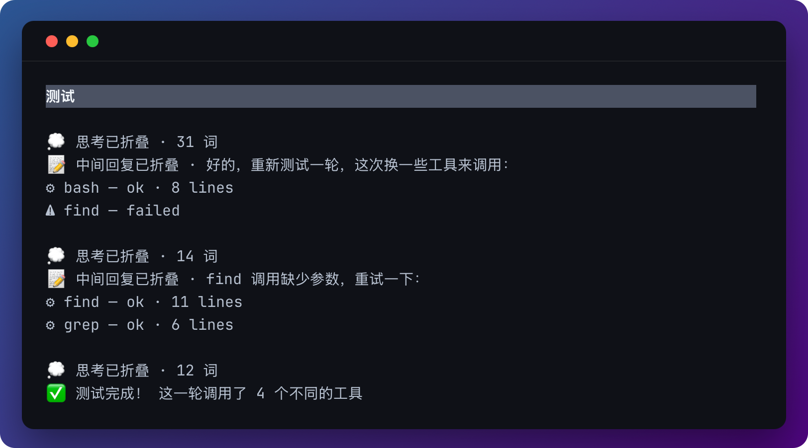
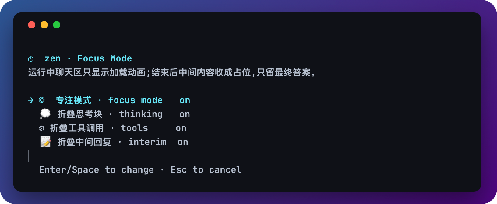

<h1 align="center">Zen-mode</h1>

<p align="center">
  运行中只显示转圈，结束后只留答案。
  <br>
  <i>Distraction-free focus mode for <a href="https://github.com/earendil-works/pi-mono">Pi</a></i>
</p>


<p align="center">
  <a href="README.md">中文</a> · <a href="README.en.md">English</a>
</p>

---

运行 pi 时，每轮对话会刷出大段 reasoning、工具调用、中间小结… **Zen-mode** 按开关把它们藏起来：关掉的那一类仍走原生 UI（思考块保持原来的样式）；开着的那一类一出现就被隐藏，跑完收成一行浅色占位，最终答案照常出现。想看被藏的过程？一个按键即可展开：



## 特性

- **运行时按开关隐藏** — 思考 / 工具 / 中间回复各自决定要不要实时显示
- **可见项走原生 UI** — 不隐藏的思考块保持 compact-thinking / 原生样式
- **结束见真章** — 最终答案全文显示,被藏的内容折成一行占位
- **随时可回看** — `ctrl+alt+r` 用原生渲染展开最近一轮过程
- **零侵入** — 与 [pi-compact-thinking](https://github.com/nostalfinals/pi-compact-thinking) 等渲染扩展共存;关闭时完全不碰它们的渲染

## 安装

```bash
pi install git:github.com/wutongyuonce/pi-zen-mode
```

然后 `/reload`（或重启 pi）。

> 只想手动试:把 `zen-mode.ts` 放进 `~/.pi/agent/extensions/`,`/reload` 即可。

更新：`pi update --extensions`

## 用法



| 按键 | 作用 |
| --- | --- |
| `ctrl+alt+f` | 开关 zen 专注模式 |
| `ctrl+alt+r` | 展开 / 收起**最近一轮**被折叠的过程 |
| `ctrl+alt+s` | 弹出选择框,可展开 / 收起**任意一轮**已折叠的对话 |
| `/zen` | 打开设置面板(风格与 `/tools` 一致) |

`ctrl+o`（pi 原生）仍可单独展开某个工具的完整输出。

> 发生 **compact**（自动或 `/compact`）或切换分支后,compact / 切换之前轮次的完整过程已被摘要替换、组件已不存在,那些折叠轮无法再展开——选择框只保留其后产生的折叠轮。

## 配置

配置在首次改动时自动生成于 `~/.pi/agent/zen-mode.json`(设置了 `$PI_CODING_AGENT_DIR` 则在其下):

```json
{
  "enabled": true,
  "hideThinking": true,
  "hideTools": true,
  "hideInterimText": true,
  "toggleKey": "ctrl+alt+f",
  "revealKey": "ctrl+alt+r",
  "pickerKey": "ctrl+alt+s"
}
```

| 字段 | 含义 |
| --- | --- |
| `enabled` | 总开关 |
| `hideThinking` | 运行时隐藏思考块;结束后折成一行 `💭`;`false` 则实时显示原生思考 UI |
| `hideTools` | 运行时隐藏工具调用;结束后折成一行 `⚙`;`false` 则实时原生渲染 |
| `hideInterimText` | 运行时隐藏中间回复;结束后折成一行;`false` 则实时显示 |
| `toggleKey` / `revealKey` / `pickerKey` | 三个快捷键,任意合法的 pi 键位字符串 |

zen 开着时三类输出都会被管起来（方便事后改开关）。三个子开关只决定**藏还是显示**，以及底栏统计。关掉某一档走原生 UI；再打开会把已结束轮次里对应的行收成占位（只重绘被管到的那些组件）。`ctrl+alt+r` 展开走原生渲染。改完 `/reload` 生效。

## 兼容性

- 需要 TUI 模式
- 与 pi-compact-thinking 并存：zen 关闭时不安装任何渲染补丁，compact-thinking 行为完全不变；开启时 zen 叠在其外层一并折叠，「展开」视图遵循内层管线（装了 compact-thinking 即显示其紧凑样式）
- 通过接管 `AssistantMessageComponent` / `ToolExecutionComponent` 渲染实现，pi 升级后内部接口变动可能需要跟进更新
- 已在 pi `0.84.x` 测试

## License

[MIT](./LICENSE)
