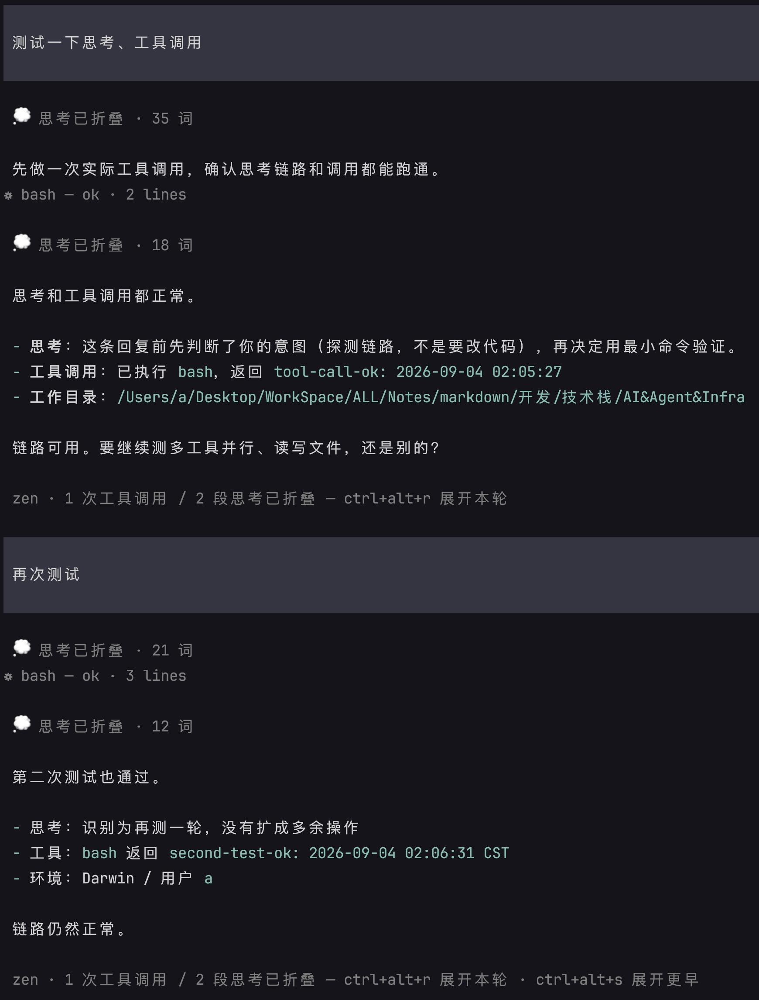
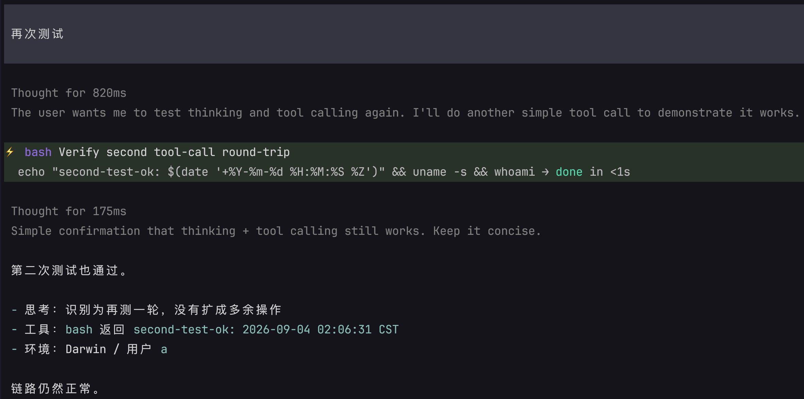
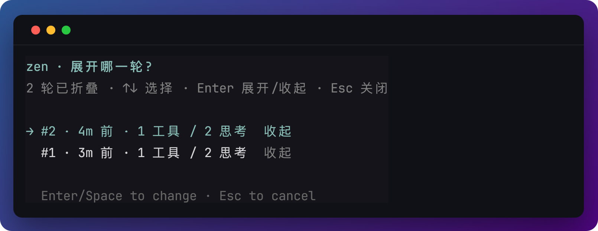
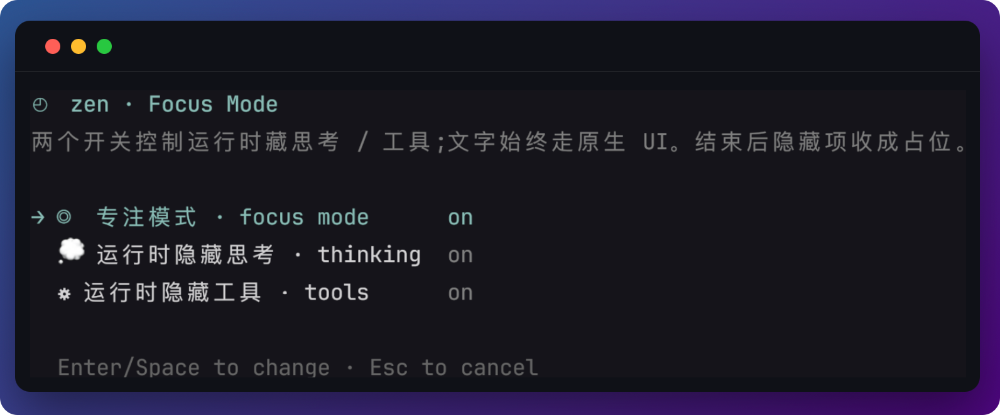

<h1 align="center">🔖 Zen-mode</h1>

<p align="center">
  藏思考和工具，文字照常流。
  <br>
  <i>Distraction-free focus mode for <a href="https://github.com/earendil-works/pi-mono">Pi</a></i>
</p>
<p align="center">
  <a href="README.md">中文</a> · <a href="README.en.md">English</a> · <a href="DESIGN.md">设计说明</a>
</p>
运行 pi 时，每轮对话会刷出大段 reasoning 和工具调用。**Zen-mode** 用开关把这两类过程输出藏起来：关掉开关，输出仍走原生 UI（思考块保持原来的样式）；开启开关，输出被隐藏。模型说的话始终照常流式输出。最终跑完隐藏的过程重新渲染成浅色占位行。

<p align="center">
  
</p>

想看被隐藏了的过程？一个按键 `Ctrl+Alt+R` 即可展开最近一轮：

<p align="center">
  
</p>

而 `Ctrl+Alt+S` 能展开更早的轮次：

<p align="center">
  
</p>

## 特性

- **按开关隐藏** — 思考 / 工具各自决定要不要实时显示；文字始终流式出现
- **可见项走原生 UI** — 不隐藏的思考块保持 compact-thinking / 原生样式
- **结束见真章** — 最终答案全文显示,被藏的内容折成一行占位
- **随时可回看** — `ctrl+alt+r` / `ctrl+alt+s` 用原生渲染展开最近一轮过程或选择更早轮次
- **零侵入** — 与 [pi-compact-thinking](https://github.com/nostalfinals/pi-compact-thinking) 等渲染扩展共存;关闭时完全不碰它们的渲染

## 安装

```bash
pi install git:github.com/wutongyuonce/pi-zen-mode
```

然后 `/reload`（或重启 pi）。

> 只想手动试:把 `zen-mode.ts` 放进 `~/.pi/agent/extensions/`,`/reload` 即可。

更新：`pi update --extensions`

## 用法

`/zen` 打开设置面板：

<p align="center">
  
</p>

除了 **focus mode 开关**之外，还有两个开关：

* **thinking 开关**，控制 focus mode 生命周期下的每轮对话是否隐藏 thinking 块
* **tools 开关**，控制 focus mode 生命周期下的每轮对话是否隐藏 tools 块

## 快捷键

| 按键         | 作用                                              |
| ------------ | ------------------------------------------------- |
| `ctrl+alt+f` | 开关 zen 专注模式                                 |
| `ctrl+alt+r` | 展开 / 收起**最近一轮**被折叠的过程               |
| `ctrl+alt+s` | 弹出选择框，可展开 / 收起**任意一轮**已折叠的对话 |

`ctrl+o` 是 Pi 自带的**全局**工具展开（不是单条）：会展开当前所有工具行，并让之后新建的工具行默认展开。一轮还在跑时 zen 仍然把工具画空；结束后若这个开关还开着，工具会按原生完整显示，不再变成一行占位。再按一次 `ctrl+o` 收起后，结束时又回到占位。

一轮还在跑时 `/zen` 和三个快捷键都会被挡住，结束后再用，避免改到一半的流式输出。

> 发生 **compact**（自动或 `/compact`）或切换分支后，compact / 切换之前轮次的完整过程已被摘要替换、组件已不存在，那些折叠轮无法再展开——选择框只保留其后产生的折叠轮。

## 配置

配置在首次改动时自动生成于 `~/.pi/agent/zen-mode.json`(设置了 `$PI_CODING_AGENT_DIR` 则在其下):

```json
{
  "enabled": true,
  "hideThinking": true,
  "hideTools": true,
  "toggleKey": "ctrl+alt+f",
  "revealKey": "ctrl+alt+r",
  "pickerKey": "ctrl+alt+s"
}
```

| 字段 | 含义 |
| --- | --- |
| `enabled` | 总开关 |
| `hideThinking` | 运行时隐藏思考块;结束后折成一行 `◈`;`false` 则实时显示原生思考 UI |
| `hideTools` | 运行时隐藏工具调用;结束后折成一行 `⚙`;`false` 则实时原生渲染 |
| `toggleKey` / `revealKey` / `pickerKey` | 三个快捷键,任意合法的 pi 键位字符串 |

zen 开着时思考和工具都会被管起来（方便事后改开关）。两个子开关只决定**藏还是显示**，以及底栏统计。文字不藏——中间那句「我先看看」和最终答案在协议里分不开，硬藏只会闪几个字再消失。关掉某一档走原生 UI；再打开会把已结束轮次里对应的行收成占位（只重绘被管到的那些组件）。`ctrl+alt+r` 展开走原生渲染。改完 `/reload` 生效。

## 兼容性

- 需要 TUI 模式
- 通过接管 `AssistantMessageComponent` / `ToolExecutionComponent` 渲染实现，pi 升级后内部接口变动可能需要跟进更新
- 已在 pi `0.84.x` 测试

## License

[MIT](./LICENSE)
